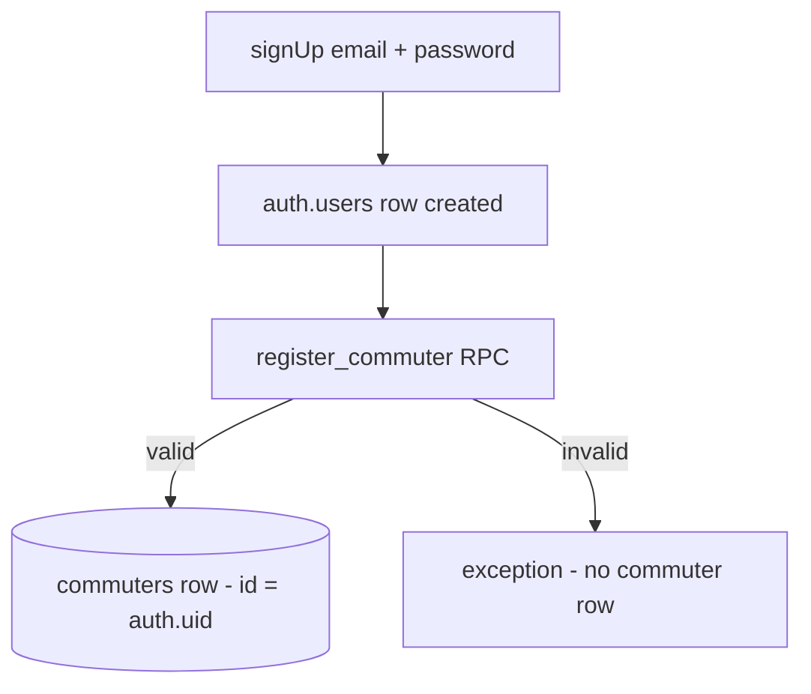
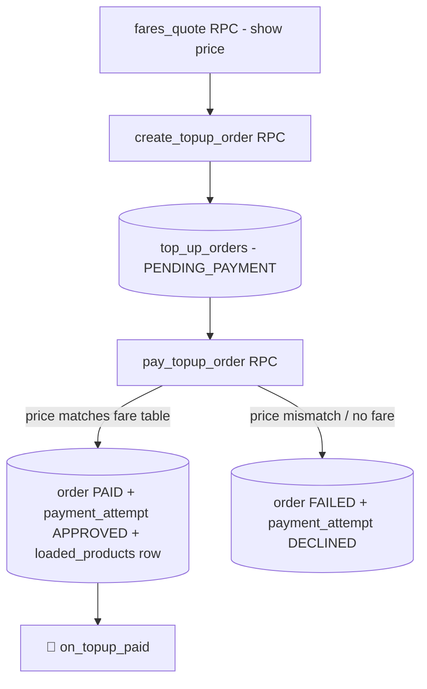
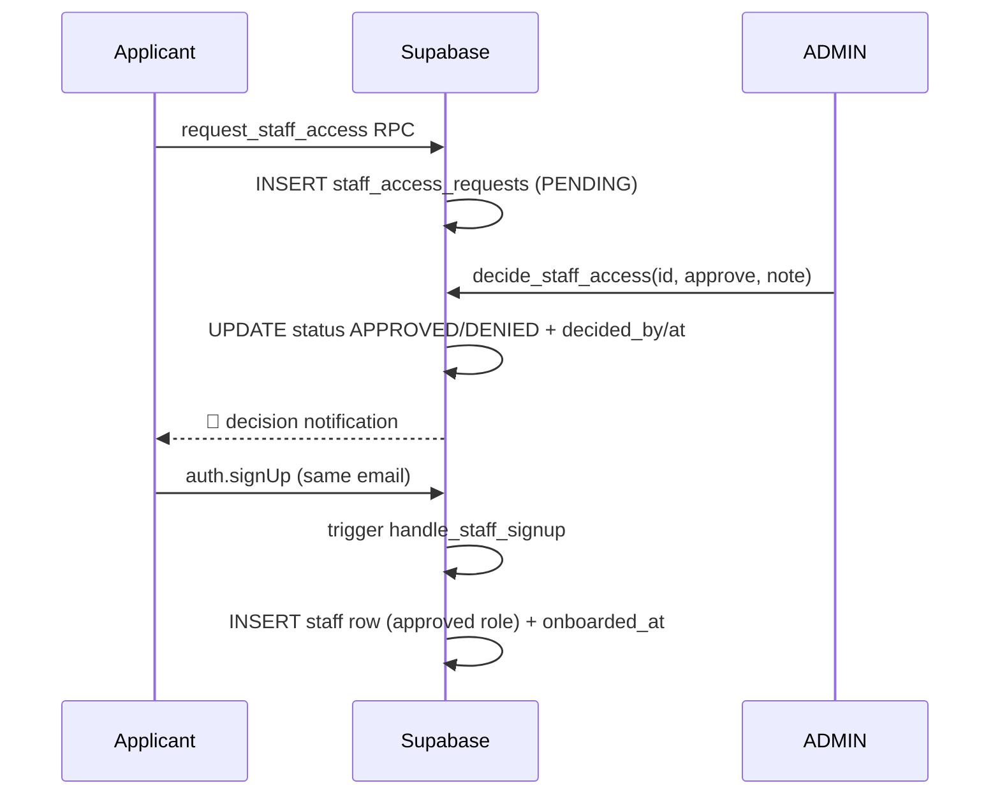

# GoldenWay Create-Flow Guide (Supabase)

How every row in the GoldenWay database gets **created**, end to end.
Source of truth: `docs/SupaBaseDB.md` (schema + RLS) and
`supabase/migrations/0001–0010`. **Supabase only** — Postgres tables, RPC
functions, RLS policies and triggers. No other backend exists in this stack:
the React app talks to PostgREST/Auth/Realtime via `@supabase/supabase-js`
(`frontend/src/lib/supabaseClient.js` → `frontend/src/api/*.js`).

---

## 0. How rows get created — the three doors

| Door | What it is | Who uses it |
|---|---|---|
| **RPC (preferred)** | `supabase.rpc('fn', args)` → SECURITY DEFINER Postgres function. Validates business rules, writes rows atomically, fires notification triggers. | Everything the commuter and staff screens do |
| **Direct table insert** | `supabase.from(table).insert({...})` — allowed only where RLS `WITH CHECK` permits it | Commuter support tickets; ADMIN/CLERK catalogue edits |
| **Auth signup** | `supabase.auth.signUp()` creates the `auth.users` row; DB triggers turn it into a profile | Commuters (then `register_commuter`) and approved staff (auto via trigger) |

Legend used below: 🔒 = guarded by RLS, ⚙️ = RPC, 🔔 = notification trigger
fires (`notifications` row + realtime push).

---

## 1. Commuter registration

**Screen:** Register · **API:** `registerCommuter()` in `src/api/goldenway.js`

1. `supabase.auth.signUp({ email, password })` → creates the auth user
   (`.env` has **Confirm email off**, so a live session comes back).
2. `⚙️ register_commuter(p_first_name, p_surname, p_phone, p_gender,
   p_date_of_birth, p_id_number, p_concession_type)`
   → **INSERT INTO `commuters`** with `id = auth.uid()`,
   `email` copied from `auth.users`.

Validation inside the RPC (one error at a time):

| Field rule | Failure message |
|---|---|
| Phone `^(\+27\|0)\d{9}$` | `phone: must be a SA mobile number…` |
| Age ≥ 5 from `date_of_birth` | `dateOfBirth: must be a valid date of birth…` |
| SA ID Luhn-13 checksum | `idNumber: this ID number fails the checksum…` |
| ID number not already used | `idNumber: an account already exists…` |

**Option A — signing up with a kiosk-issued card** (card `GW-XXXX-XXXX` in
hand): before signup call `⚙️ lookup_card_at_signup(p_card_number, p_id_number)`
(read-only check that an **UNREGISTERED** card was issued for that exact
ID). After signup, `⚙️ link_existing_card(p_card_number, p_id_number)` →
**UPDATE `gold_cards`** SET `owner_id = auth.uid(), registered_at = now(),
status = 'ACTIVE'`. No new card row is created — the kiosk card is claimed.
🔔 `on_card_registered` notifies the commuter.

**Option B — no card:** the card appears automatically on first login (§2).

---

## 2. First login — auto Gold Card (BR-01)

**API:** `getOrCreateMyCard()` · called by `TripProvider` on login

`⚙️ get_or_create_my_card()`:

- Card already linked? → returns it (with `loaded_products` nested as JSON).
- No card? → `generate_card_number()` then
  **INSERT INTO `gold_cards`** (`card_number`, `status = 'ACTIVE'`,
  `owner_id = auth.uid()`, `registered_at = now()`).

Result: every commuter ends up with exactly **one** card, created
atomically server-side. The "your card is waiting on the Home screen"
behaviour is this RPC.

---

## 3. Buying a Gold Card in-app (R40 once-off)

**API:** `order_gold_card()` — RPC, no args, caller is the buyer.

Single atomic RPC that creates **three** rows:

| Table | Row |
|---|---|
| `gold_cards` | New card, `status = 'ACTIVE'`, owned by caller immediately (balance protection applies at once) |
| `top_up_orders` | R40 once-off, `status = 'PAID'`, own `receipt_reference` |
| `payment_attempts` | `gateway = 'SIMULATED'`, `status = 'APPROVED'` |

---

## 4. Loading trips (top-up)

**Screens:** Load Trips · **API:** `createTopupOrder()` + `payTopupOrder()`

**Step 1 — quote (read):** `⚙️ fares_quote(p_route_code, p_product_code,
p_concession_type)` → effective-dated price from `fare_table_entries`
(BR-09 price authority) with concession discount applied
(STUDENT/PENSIONER). UI helpers: `fetchRoutesFromDb()`,
`fetchProductsForRouteFromDb()`, `fetchQuoteFromDb()`.

**Step 2 — create order:** `⚙️ create_topup_order(p_card_number,
p_product_code, p_route_code, p_amount_cents)` → 🔒 verifies
`gold_cards.owner_id = auth.uid()` → **INSERT INTO `top_up_orders`**
(`status = 'PENDING_PAYMENT'`).

**Step 3 — pay:** `⚙️ pay_topup_order(p_order_id)`:
1. Re-checks ownership + `PENDING_PAYMENT`.
2. **Price authority:** looks up the live fare-table price for
   (product, route, today). Mismatch or missing fare → order **FAILED**,
   **INSERT `payment_attempts` DECLINED**, business error `55000`.
3. Card `LOST`/`EXPIRED` → rejected.
4. Success → order `PAID` + `receipt_reference = generate_receipt_reference()`,
   **INSERT `payment_attempts` APPROVED**,
   **INSERT `loaded_products`** (journeys/validity copied from
   `fare_products`), 🔔 notifies the commuter.

Refunds (ADMIN/CLERK): `⚙️ refund_topup_order(p_order_id)` → order
`REFUNDED`.

---

## 5. Tapping a journey

**API:** `tapJourney()` · RPC: `tap_journey`

`⚙️ tap_journey(p_card_number, p_route_code, p_bus_id, p_validator_id)`:

1. 🔒 Caller must own the card.
2. Picks the best valid `loaded_products` row (journeys left, not expired).
3. **Free transfer (BR-04):** if the most recent paid tap was ≤ 60 min ago,
   was itself a paid tap (`was_transfer = false`), was on a
   transfer-allowing product, **and the new tap is a different route** —
   the tap is free: no journey is deducted, and a
   **INSERT INTO `deductions`** row is written with `was_transfer = true`
   (same `loaded_product_id` as the paid leg).
4. Otherwise deducts one journey (`journeys_used + 1`) and
   **INSERT INTO `deductions`** (route, bus, validator, timestamp).
5. 🔔 `on_journey_tapped` → `notifications` row for the commuter.

Reads that power the screen: `⚙️ journeys_remaining(p_card_number)`,
`cardHistory()` (`SELECT … FROM deductions` 🔒 own-card rows only).

---

## 6. Support tickets (commuter ↔ agent)

**Screens:** SupportScreen / InboxScreen · **API:** `createTicket()`,
`sendCommuterMessage()`, `claimTicket()`, `replyTicket()`, …

**Commuter side:**

1. **Direct INSERT INTO `support_tickets`** (`subject`,
   `status = 'OPEN'`, `priority = 'NORMAL'`) — RLS
   `WITH CHECK (commuter_id = auth.uid())` stamps ownership.
2. First message via `⚙️ add_ticket_message(p_ticket_id, 'COMMUTER', body)`
   → **INSERT INTO `ticket_messages`**. 🔔 `on_ticket_created` pings agents.

**Agent side (0009 RPCs, all staff-gated):**

| RPC | Effect |
|---|---|
| `ticket_queue()` | Read: OPEN/IN_PROGRESS tickets |
| `claim_ticket(p_ticket_id)` | `assigned_to = agent.uid()`, status `IN_PROGRESS` |
| `reply_ticket(p_ticket_id, p_body)` | **INSERT `ticket_messages`** (sender `AGENT`) + 🔔 to commuter |
| `resolve_ticket(p_ticket_id)` | status `RESOLVED` |
| `escalate_ticket(p_ticket_id, p_note)` | priority/`HIGH` + note |
| `agents_online()` | Read: staff currently handling tickets |

---

## 7. Staff onboarding (access request → approval → first login)

**Screens:** staff login / ADMIN onboarding queue · **API:** `staff.js`

1. `⚙️ request_staff_access(p_email, p_first_name, p_surname,
   p_requested_role, p_motivation)` → **INSERT `staff_access_requests`**
   (`PENDING`). RLS allows this insert for anyone (even pre-auth).
2. ADMIN: `⚙️ decide_staff_access(p_request_id, p_approve, p_note)` →
   UPDATE to `APPROVED`/`DENIED` with `decided_by`, `decided_at`.
   🔔 `on_staff_decision` notifies the applicant.
3. Approved person runs the normal **staff login/signup** with that email.
   Trigger `on_auth_user_staff_signup` → `⚙️ handle_staff_signup()` →
   **INSERT INTO `staff`** with the approved role and marks
   `onboarded_at`. The pending state is resolved by `my_staff_request_status()`
   on the login screen.
4. ADMIN extras: `⚙️ create_staff_member(...)` (direct invite) and
   `⚙️ set_staff_active(p_staff_id, p_active)` (deactivate).
   Every decision is audited into `staff_action_log` (ADMIN-only read).

---

## 8. Driver run + automatic service alerts

**Screen:** RunsScreen · **API:** `startRun()`, `reportRunStatus()`

1. `⚙️ start_run(p_route_code, p_bus_id, p_direction)` →
   **INSERT INTO `vehicle_runs`** (`status = 'ON_TIME'`,
   `driver_id = auth.uid()`). RLS `WITH CHECK` demands
   `driver_id = auth.uid()` (or ADMIN), and the RPC validates the route is
   active and the bus exists.
2. `⚙️ report_run_status(p_run_id, p_status, p_delay_minutes, p_note)` →
   UPDATE the run (`ON_TIME → DELAYED / BREAKDOWN / DIVERTED / COMPLETED`).
3. Trigger `on_run_status_change` → on **DELAYED/BREAKDOWN** a
   `service_alerts` row is auto-created for the route; 🔔 pushes to that
   route's commuters. No clerk has to type the alert — the report **is**
   the alert.
4. Commuter surfaces: `fetchLiveAlerts()` (`service_alerts` 🔒 read),
   `fetchLiveRuns(routeCode)` (`vehicle_runs` 🔒 staff read).

---

## 9. Handheld inspection (verify + log outcome)

**Screen:** VerifyScreen · **API:** `lookupCardForInspection()`,
`logInspectionOutcome()`

1. `⚙️ lookup_card_for_inspection(p_card_number)` — read-only verification
   (card status, journeys remaining, loaded products). Staff-only.
2. `⚙️ log_inspection_outcome(p_card_number, p_outcome, p_note)` →
   **INSERT INTO `inspection_events`** (`inspector_id = auth.uid()`;
   RLS `WITH CHECK` enforces it). Outcomes: `VALID`, `NO_PRODUCT`,
   `EXPIRED_PRODUCT`, `UNREGISTERED_CARD`, `REFUSED`.
3. 🔔 `on_inspection` notifies the card owner when the outcome is bad.

History: `fetchRecentInspections()` 🔒 `is_staff(ADMIN, INSPECTOR)` read.

---

## 10. Clerk kiosk (card issue, cash sale, lost-card replace)

**Screen:** KioskScreen · **API:** `clerkIssueCard()`, `recordCashSale()`,
`clerkReplaceLostCard()`

| RPC | Rows created / changed |
|---|---|
| `⚙️ clerk_issue_card(p_id_number, p_route_code?, p_product_code?)` | **INSERT `gold_cards`** — `UNREGISTERED`, `issued_for_id = ID number`, `issued_by = clerk`, `issued_at = now()`. Card stays unclaimed until the commuter signs up with that ID (§1 Option A). |
| `⚙️ record_cash_sale(p_card_number, p_product_code, p_route_code)` | **INSERT `top_up_orders`** (PAID) + **INSERT `payment_attempts`** (`gateway = 'CASH'`, APPROVED) + **INSERT `loaded_products`** — a walk-up cash load. |
| `⚙️ clerk_replace_lost_card(p_old_card_number)` | Old card → `status = 'LOST'`; **INSERT `gold_cards`** replacement issued for the same owner. |

Kiosk dashboards read: `fetchMyKioskSalesToday()`, `fetchKioskSalesSummary()`,
`fetchKioskActivityToday()`.

---

## 11. Concession verification (student / pensioner)

**Screen:** ConcessionsScreen · **API:** `verifyConcession()`

`⚙️ verify_concession(p_commuter_id)` — CLERK/ADMIN only (RPC checks
`is_staff('ADMIN','CLERK')`) → UPDATE `commuters.concession_verified_at =
now()`. 🔔 `on_concession_verified` tells the commuter their discount is
live. Queue reads: `fetchPendingConcessions()`,
`fetchRecentVerifiedConcessions()`.

---

## 12. Notifications & realtime

**Provider:** `NotificationProvider.jsx` · **API:** `fetchNotifications()`,
`fetchUnreadCount()`, `markNotificationsRead()`

- **Rows are created only by triggers** (never inserted by the app):
  `on_topup_paid`, `on_journey_tapped`, `on_alert_published`,
  `on_ticket_created`, `on_ticket_message`, `on_concession_verified`,
  `on_card_registered`, `on_inspection`, `on_staff_decision`,
  `on_run_status_change`.
- 🔒 `notifications_select_own` — users only ever see `user_id = auth.uid()`.
- The bell subscribes via Realtime (`supabase.removeChannel` on unmount);
  the table is in the `supabase_realtime` publication.
- `⚙️ mark_notifications_read(p_ids?)` → UPDATE `read_at`
  (RLS `notifications_update_own`).

---

## 13. Reference — who creates rows in each table

| Table | Created by | Actor |
|---|---|---|
| `commuters` | `register_commuter` RPC | Commuter (self, at signup) |
| `staff` | `handle_staff_signup` trigger (approved signup) / `create_staff_member` RPC | DB trigger / ADMIN |
| `staff_access_requests` | `request_staff_access` RPC | Applicant (pre-auth allowed) |
| `gold_cards` | `get_or_create_my_card`, `order_gold_card`, `clerk_issue_card`, `clerk_replace_lost_card` | Commuter / Clerk |
| `loaded_products` | `pay_topup_order`, `record_cash_sale` | Commuter / Clerk |
| `top_up_orders` | `create_topup_order`, `order_gold_card`, `record_cash_sale` | Commuter / Clerk |
| `payment_attempts` | `pay_topup_order`, `order_gold_card`, `record_cash_sale` | System (gateway simulation) |
| `deductions` | `tap_journey` | Commuter (tap) |
| `support_tickets` | direct INSERT (RLS `commuter_id = auth.uid()`) | Commuter |
| `ticket_messages` | `add_ticket_message` / `reply_ticket` | Commuter / Agent |
| `vehicle_runs` | `start_run` | Driver |
| `inspection_events` | `log_inspection_outcome` | Inspector |
| `service_alerts` | ADMIN/CLERK direct write + `on_run_status_change` trigger | Staff / auto |
| `notifications` | 10 notification triggers only | System |
| `staff_action_log` | inside SECURITY DEFINER staff RPCs | System (audit) |
| `routes`, `stops`, `fare_products`, `fare_table_entries`, `route_departures` | direct writes (seeded by 0003/0004) | ADMIN/CLERK (RLS-gated) |
| `buses` | direct writes (seeded by 0006) | ADMIN only (RLS-gated) |

---

## 14. Testing the flows with the seeded demo data

Project: `https://zosmjkmlbodqfttmzoll.supabase.co` (creds in
`frontend/.env`). All demo passwords: `GoldenWay!2026`.

| Try this | Expect |
|---|---|
| Sign up as `thandi.dlamuki@gmail.com` + kiosk card `GW-1234-5678` | `lookup_card_at_signup` shows 17 journeys; `link_existing_card` flips it to `ACTIVE` owned by Thandi |
| Sign up fresh (e.g. `sipho.mahlangue@gmail.com`) with no card | First login auto-creates a card via `get_or_create_my_card` |
| Load GOEASY-10 on KHA-CPT | Order → PAID → `loaded_products` row; notification bell rings |
| Tap twice within 60 min on a different route | Second tap is a free transfer (`was_transfer = true`, no journey deducted) |
| Driver reports BREAKDOWN | `service_alerts` row appears automatically for that route |
| Inspector checks `GW-1234-5678` | `verify_card`-equivalent lookup + logged `inspection_events` row |

Full audit: `cd supabase && node check-seed.mjs <url> <service-key> [publishable-key]`.

---

## 15. Error quick-reference

| Error | Meaning | Where |
|---|---|---|
| `28000 AUTH_REQUIRED` | RPC called with no session | All commuter RPCs |
| `42501 FORBIDDEN` | RLS or role check failed (e.g. commuter calling a staff RPC) | RLS + staff RPCs |
| `55000` (message explains) | Business rule: price changed, order already paid, card LOST, wrong status | `pay_topup_order` etc. |
| `PGRST202` | RPC name/args wrong — check the signature in `supabase/migrations/` | Any RPC call |
| `23505` duplicate | Unique violation (e.g. ID number already registered) | `register_commuter` |

*Companion docs: `docs/SupaBaseDB.md` (schema + RLS),
`docs/DATABASE-STATUS.md` (live DB state), `SETUP.md` (env + seeding).*
